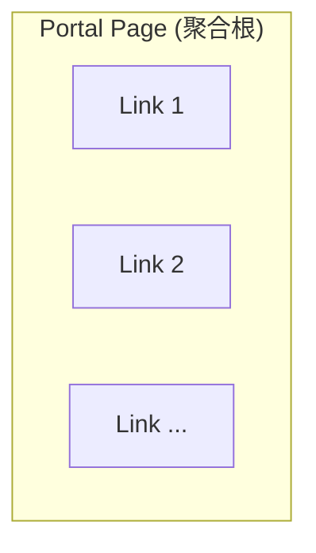

# Portal Page

## 介紹

Portal Page 實體代表使用者在 Portal Link 平台上的個人化連結整合頁面，是系統中的核心領域物件，同時也是 **聚合根（Aggregate Root）**。此實體封裝了使用者專屬頁面的基本屬性，包括唯一識別碼、頁面識別名稱、個人簡介、主題設定等重要資訊。每個使用者可以擁有一個專屬的 Portal Page，用於展示所有重要的社群、網站、商店連結給朋友、粉絲或客戶。

作為聚合根，Portal Page 負責管理其內部的所有 Link 實體，確保聚合內部的一致性和業務規則。所有對 Link 的操作都必須透過 Portal Page 來進行。

## 屬性

...

## 聚合設計

Portal Page 作為聚合根，負責管理以下實體：

- **Link**：Portal Page 中的連結項目（請參考 [link_entity](link_entity.md)）

### 業務規則

- 一個 Portal Page 的 `slug` 在系統中必須是唯一的
- Portal Page 必須屬於一個有效的使用者（User）
