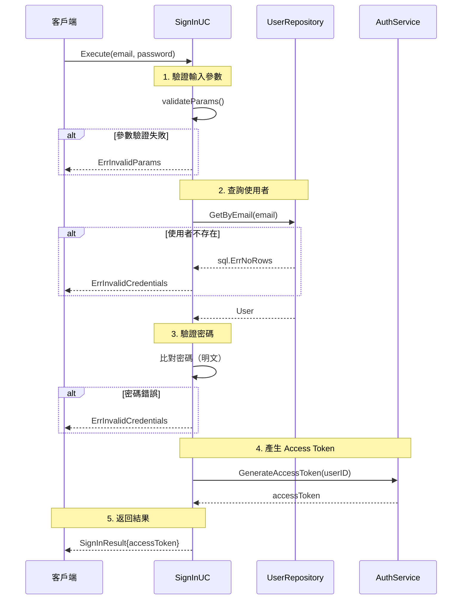

# Sign In

## 概述

此用例允許已註冊使用者登入 Portal Link 帳號。使用者需要提供電子郵件和密碼，系統將驗證憑證並返回 access token。

**主要參與者：** 已註冊使用者

## 輸入參數

| 參數 | 型態 | 必填 | 說明 | 驗證規則 |
|------|------|------|------|----------|
| email | string | 是 | 電子郵件地址 | 必須符合 email 格式，長度 1-255 字元 |
| password | string | 是 | 使用者密碼 | 最少 8 字元 |

## 輸出結果

**成功時：**
```json
{
  "access_token": "eyJhbGciOiJIUzI1NiIsInR5cCI6IkpXVCJ9..."
}
```

## 主要流程

1. 使用者提交登入資訊（電子郵件、密碼）
2. 系統驗證輸入參數格式
3. 系統根據電子郵件地址查詢使用者
4. 系統驗證密碼是否正確
5. 系統使用 `GenerateAccessToken` 方法產生該 User 的 access_token（詳見 [Authentication](../../../auth.md)）
6. 系統返回 access_token

## 時序圖



## 錯誤結果

### 輸入參數驗證失敗
- 系統返回錯誤 `ErrInvalidParams`

### 使用者不存在
- 系統返回錯誤 `ErrInvalidCredentials`

### 密碼錯誤
- 系統返回錯誤 `ErrInvalidCredentials`

## 業務規則

- 密碼暫時以明文方式比對
  - **TODO:** 後續討論密碼加密方式（如 bcrypt）
- 登入失敗時不透露具體原因（使用者不存在 or 密碼錯誤），統一返回 `ErrInvalidCredentials`
- Access token 產生方式：請參考 [Authentication](../../../auth.md)

## 相關物件

- **User Entity**: 使用者領域實體
- **User Repository**: 使用者資料存取介面
